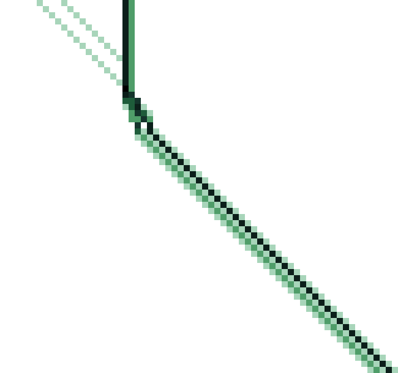
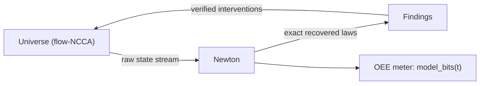

# APEIRON
### A Digital Universe of 0 and 1, with a Law-Discovering Machine Inside It

A mass-conserving cellular-automata universe (the *flow family*) and a
machine that recovers its laws exactly from raw states — then intervenes,
with every intervention verified against ground truth we hold.

**One closed loop. Nothing enters from outside. Eighteen rounds of genuine
novelty came out.**



*Spacetime of the AND gate inside the universe (law 22126, one run, real
data): two input pulses travel right, deposit into the memory cell
(dark block holds), the second deposit fires the output pulse — which
leaves rightward while the memory restores. Generated from the
deterministic run; see `experiments/m2/figures.py`.*



*The closed loop: nothing enters from outside — and the model keeps growing.*

---

## Start here

- [`map/MANIFESTO.md`](map/MANIFESTO.md) — the vision, and the three-walls
  answer to *is open-ended evolution possible in a closed universe?*
- [`map/PRIOR-ART.md`](map/PRIOR-ART.md) — the examined prior art and the
  bounded novelty claims.
- [`map/STATUS.md`](map/STATUS.md) — milestone table, discovered constants
  and theorems, one-command reproduction.
- [`docs/RESEARCH-LOG.md`](docs/RESEARCH-LOG.md) — all 24 research logs,
  every number traceable.

## Headline results

- Exact law recovery: 4096/4096 entries from raw states; macro flux curve,
  held-out MAE 0.0
- Engine: 2.31×10⁹ cell-updates/s, bit-identical across thread counts
- The free-flow bound: J = mass/n, digit-precise — a conservation ceiling
- A reaction-front **replicator**: one seed → the whole universe as a
  crystal of itself (4/4 seeds; unseeded control = 0)
- A **perpetuum ecologis**: 10 species, populations still swinging at 10⁶
  steps, anti-phase predation signature ρ ≤ −0.7
- Logic gates **inside the universe**: a regenerative OR, an AND gate
  (truth table [0,0,0,1]; one-shot — collapses after emitting, per our own
  public errata), and a two-gate circuit — (A∧B)∧C, 8/8 rows exact

## Reproduce

```
python experiments/m2/gate.py      # the first gate
python experiments/m2/circuit.py   # the two-gate circuit
python experiments/m2/oee_meter.py # the open-endedness meter to 10^6 steps
cargo test --release && pytest analysis/tests/
```

*Project name: **Apeiron** (ἄπειρον — the unbounded). Repositories and
packages: `apeiron-ca`. The slack instrument will be named **kenoma**.*
